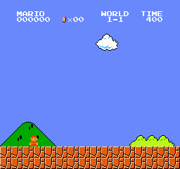

# jev-clef-experiments

Hobby experiments driving simulators with *System One* decision models: [Jev](https://docs.typesafe.ai)
(TypeSafe, text only) and [Clef](https://developers.cloudflare.com/workers-ai/models/clef/) (Cloudflare,
text plus up to 4 images). Same request shape for both: a `state` and a map of typed questions
(`choice`, `score`, `noul`); the answer is a probability for every option.



Clef (27B) clearing Super Mario Bros 1-1 from pixels in 68 calls. No RAM reading for decisions, no training.

## Setup

```bash
uv sync                 # Python 3.13+, creates .venv
cp .env.example .env    # fill in the keys you need
```

| Variable | Needed for | Where |
|---|---|---|
| `CLOUDFLARE_ACCOUNT_ID` | clef | Cloudflare dashboard |
| `CLOUDFLARE_API_TOKEN` | clef | My Profile → API Tokens → "Workers AI" template |
| `CLEF_MODEL` | optional | `clef-flash` (9B, default) or `clef` (27B). Mario only clears 1-1 with `clef` |
| `OPENROUTER_API_KEY` | jev | openrouter.ai/settings/keys |

Input-token pricing at the time of writing: clef $0.24/M, clef-flash $0.09/M, Jev $0.042/M.

## mario

[`gym-super-mario-bros`](https://github.com/Kautenja/gym-super-mario-bros) (ships the ROM) + `nes-py`.
Every decision sends the last 4 frames to Clef, holds the resulting input for 12 emulator frames, and if
Mario is airborne waits for him to land before asking again.

```bash
uv run mario --policy random      # emulator check, no key needed
CLEF_MODEL=clef uv run mario      # the run in the GIF
uv run mario --buttons            # naive baseline: ask Clef which button to press
```

Two ways to ask:

- **Perception (default).** Three `score` questions with distance levels (none / far / medium / close):
  nearest enemy, nearest pipe, nearest hole. A few lines of code turn them into buttons: walk, run when
  terrain is coming, short hop for enemies, long running jump for pipes and holes.
- **`--buttons`.** One `choice` question: which input to hold. Clef is the whole policy.

What the model sees (`--view`): `mask` greys out everything behind Mario (default), `full` is the raw
screen, `crop` is a window around him. Mario's screen x comes from NES RAM `0x03AD`, airborne from `0x001D`.

Results on 1-1. Clef is deterministic, so one run per config is the result:

| Config | Reached |
|---|---|
| `--buttons`, flash or 27B | x≈700, second goomba |
| perception, yes/no questions, 27B | x=1128 to 1792 |
| perception, distance scores, land before deciding, 27B | x=1520 to 1669 |
| perception, distance scores, behind-Mario masked, 27B | **flag, x=3161, 68 calls** |
| same config, clef-flash | x≈1130, first hole |

What mattered, in order: ask for perception instead of buttons; never decide mid-air; one long jump per
threat instead of chained hops; jump thresholds below what the model reports, it under-estimates
closeness by a tile or two; mask what is behind Mario, otherwise he saw the hole he just crossed and
jumped into the next goomba.

Every run writes a CSV (position, action, scores, latency per decision) and a GIF to `mario/outputs/`.

## pendulum and double-pendulum

Cart-pole and double inverted pendulum on a cart, pure numpy, with an LQR as ground truth. Policies:
`lqr`, `jev` (numeric state as JSON) and `clef` (last 4 rendered frames, `--text-state` adds the numbers).
The force applied is the probability-weighted mean over 7 force buckets, `--argmax` uses the top bucket.
The sim pauses while the model thinks; `--realtime` keeps simulating with the stale force so you can find
the latency at which the controller breaks.

```bash
uv run pendulum --policy lqr
uv run pendulum --policy jev
uv run pendulum --policy clef --text-state
uv run double-pendulum --policy clef --text-state
```

Each run prints steps survived, sign agreement and correlation with the LQR, and mean latency. So far
no model balances either pendulum for more than ~2 s; clef with pixels only pushes the wrong way, with
the numbers added it gets the sign right but the forces are too timid.

## Layout

```
pyproject.toml       one uv project; `pendulum`, `double-pendulum`, `mario` are entry points
common/decision.py   ask(backend, state, questions, images) -> (answers, latency) for clef and jev
common/control.py    discrete LQR for a given decision period (numpy only)
common/viewer.py     live tkinter window
pendulum/            sim.py (physics, render, LQR) + run.py (generic loop over a sim module)
double_pendulum/     sim.py with the same interface; reuses pendulum.run
mario/run.py         emulator loop, questions, perception policy
*/outputs/           CSV + GIF per run (gitignored)
```

Related: [VBS2004/jev-plays-super-mario-bros](https://github.com/VBS2004/jev-plays-super-mario-bros)
plays Mario with Jev by translating NES RAM into JSON facts. No Nintendo ROM is included here; the
emulator package ships its own.
